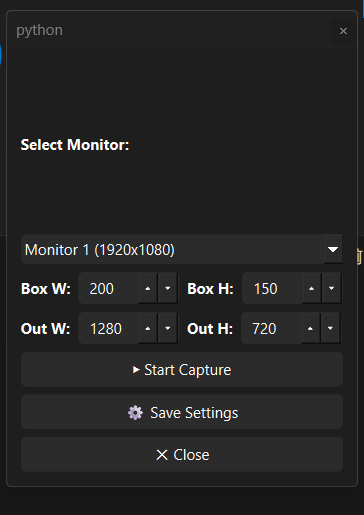
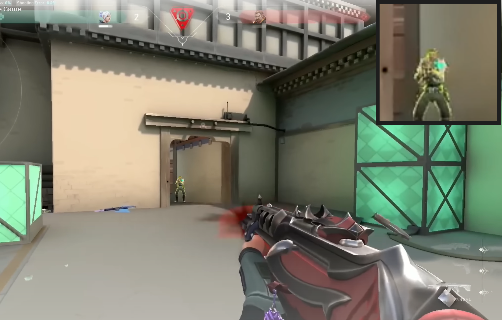

# 🎯 Valorant Center Zoom

A lightweight and customizable **screen zoom utility** built with **PyQt6, OpenCV, and MSS**.  
Designed for games like **Valorant**, this tool allows you to capture the center of your monitor and zoom it in real-time, making it easier to **analyze, train, or stream your gameplay**.

---

## 🚀 Features

- 📌 Real-time **center screen capture & zoom**
- 🎛 Adjustable **box size & output resolution**
- 🖥 Supports **multiple monitors**
- 🪟 Floating **drag-and-drop control button**
- ⚙️ Minimal **control panel** with monitor & size settings
- 🔄 Dynamic zoom window resizing
- 🖱 Zoom window is **draggable like a floating HUD**
- 🎮 Stays on top of your game window

---

## 🖼 Screenshots

> ⚡ Add your screenshots in a `screenshots/` folder and link them here.

- Floating Controls  
  

- Control Panel  
  

- Zoomed View  
  

---


### 💾 Download Executable
If you don’t want to build from source, you can directly **[ValorantCenterZoom.exe](/dist/)** from the releases section.

---


## 🛠 Installation

### 1. Clone the Repository
```bash
git clone https://github.com/your-username/valorant-center-zoom.git
cd valorant-center-zoom
```

### 2. Install Dependencies
Make sure you have **Python 3.9+** installed. Then run:
```bash
pip install -r requirements.txt
```

Your `requirements.txt` should include:
```
opencv-python
numpy
mss
PyQt6
```

---

## ▶️ Usage

Run the script:
```bash
python main.py
```

### Controls
- 🟢 **Floating Button** → Drag anywhere on screen, click ☰ to open control panel  
- ⚙️ **Control Panel** → Change monitor, box size, and output resolution  
- 🖥 **Zoom Window** → Shows the magnified center of the selected monitor  
- ❌ Press **Q** inside the zoom window to close it  
- 🖱 Drag the zoom window like a floating HUD  

---

## 📂 Project Structure
```
valorant-center-zoom/
│── main.py               # Entry point
│── requirements.txt      # Dependencies
│── screenshots/          # Place your screenshots here
│── README.md             # Project documentation
```

---

## 🎮 Example Use Cases
- **Valorant Aim Training** → Focus on your crosshair area  
- **Gameplay Recording/Streaming** → Highlight important screen regions  
- **Multi-Monitor Productivity** → Zoom into one monitor while working on another  

---

## 📜 License
This project is licensed under the MIT License.  
Feel free to modify and share ✨

---

## 🤝 Contributing
Pull requests are welcome!  
For major changes, please open an issue first to discuss what you’d like to change.

---

## ⭐ Support
If you like this project, don’t forget to **star ⭐ the repo** and share it with others!


